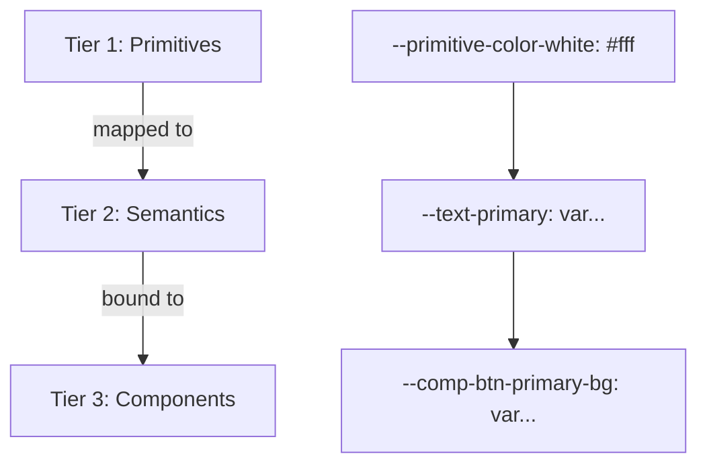

# Andreas Krieger — Design System Architecture

Dieses Design-System definiert die visuelle Sprache, die semantischen Design-Tokens und die Komponenten-Architektur für die persönliche Web-Präsenz (`andreaskrieger.github.io`).

---

## 1. Typografie-Architektur (The 3-Layer Scale)

Die Typografie basiert auf einer präzise aufeinander abgestimmten 3-Schichten-Hierarchie:

| Schicht | Schriftfamilie | Schnitt & Tracking | Verwendungszweck |
|---|---|---|---|
| **Display / Headline** | `Pixelify Sans` | Semibold (`600`), Tracking `0.08em` | Hero Title, Sektionsüberschriften (`h1`, `h2`, `h3`) |
| **Body / Copy** | `Inter` | Regular/Medium (`400`/`500`), Zeilenhöhe `1.7` | Fließtext, Beschreibungen, Essays |
| **Meta / Data Layer** | `IBM Plex Mono` | Medium (`500`/`600`), Tracking `0.05em`, Uppercase | Badges, Chips, Navigation, Status-Labels, Buttons |

---

## 2. 3-Tier Token-Architektur

Die CSS-Variablen folgen dem modernen **W3C Design Token Standard**:



1. **Tier 1: Primitives (`tokens.css`)**
   * Reine Rohwerte (Farb-Hex, 4px Spacing-Grid, Radien-Skala, Schatten).
2. **Tier 2: Semantics (`tokens.css`)**
   * Bedeutung & Rolle (`--surface-card`, `--text-secondary`, `--border-subtle`, `--status-online`).
3. **Tier 3: Components (`components/*.css`)**
   * Element-spezifische Bindungen (`--comp-card-padding`, `--comp-btn-primary-bg`).

---

## 3. Dateistruktur

```
andreaskrieger.github.io/
├── index.html                  # Semantisches HTML5-Markup
├── DESIGN_SYSTEM.md            # Diese Spezifikation
├── README.md                   # Repository-Dokumentation
└── assets/
    ├── css/
    │   ├── tokens.css          # 3-Tier Design Tokens
    │   ├── reset.css           # Barrierefreier CSS Reset
    │   ├── typography.css      # Typografie-Skala & Font Stacks
    │   ├── layout.css          # Layout-Grid & Container
    │   ├── main.css            # Master Bundle (Imports)
    │   └── components/
    │       ├── nav.css         # Frosted Glass Navbar
    │       ├── cards.css       # Spotlight Glass Cards
    │       ├── buttons.css     # High-Contrast & Glass Buttons
    │       └── badges.css      # Technical Chips & Status Dots
    └── js/
        └── main.js             # Mouse-Tracking Spotlight Engine
```

---

## 4. UI-Komponenten-Referenz

### Spotlight Glass Card
```html
<article class="spotlight-card">
    <div class="card-header">
        <div class="card-tag">// CATEGORY_TAG</div>
        <h3 class="card-title">Titel des Werkes</h3>
        <p class="card-body">Beschreibungstext...</p>
        <div class="card-meta-list">
            <span class="chip highlight">Tech 1</span>
            <span class="chip">Tech 2</span>
        </div>
    </div>
    <a href="#" class="card-action-link">Aktion öffnen <span>→</span></a>
</article>
```

### Buttons
```html
<!-- Primary White CTA -->
<a href="#projekte" class="btn btn-primary">Projekte entdecken</a>

<!-- Secondary Frosted Glass -->
<a href="https://github.com/AndreasKrieger" class="btn btn-secondary">GitHub Profil ↗</a>
```

### Status Badge
```html
<div class="status-badge">
    <span class="status-dot"></span>
    <span>STATUS_LABEL</span>
</div>
```

---

## 5. Zukünftige Erweiterungsschritte

* **Unterseiten**: Projekt-Detailseiten (`/projects/djbox.html`) erben direkt `assets/css/main.css`.
* **Theming**: Für spätere Akzentfarben oder Themes müssen nur die Tier-2 Semantik-Tokens in `tokens.css` angepasst werden.
